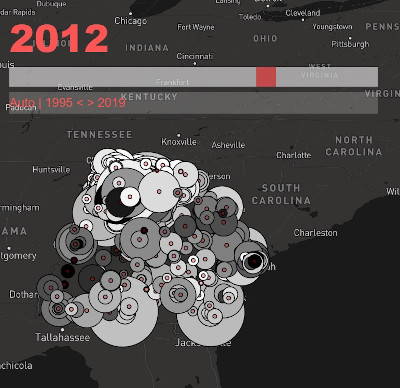

# gaschool-scraper
A set of python scripts used to scrape and build databases of information on Georgia public schools. This data is displayed [online](http://rmgilbertcivilrightsmuseum.com/savschools/schoolmap/) as part of the Savannah School Project at the Ralph Mark Gilbert Civil Rights Museum.

## Project Description
The scripts collected in this repo were used to scrape data from the Georgia Department of Education and create databases used in the Savannah Schools Project at the [Ralph Mark Gilbert Civil Rights Museum](http://rmgilbertcivilrightsmuseum.com/)

The Savannah Schools Project will collect a multi-generational archive of histories from members of Savannah's community that attended local schools. 

Visitors to our website can explore an interactive map of schools data pulled from the Georgia Department of Education. There they can observe how school populations have changed over the past 25 years. In addition, they can share their Savannah education stories with the community. 

Equality in education is a civil rights issue that has impacted past generations and will influence the future of the city. Community members can share their Savannah education stories and be a part of a community history exhibit at the Ralph Mark Gilbert Civil Rights Museum. 

## Repo Contents Description
The 11 python scripts in this repository were used to scrape, process and organize databases that were fed to the data visualization app on the museum website.

You can also find the raw and processed data collected for the project in the 'Addresses' 'Data' 'Exports' and 'Final Data Exports' folders. I will share this information on Kaggle at a later date.

Below you can find step by step descriptions of the script functions. I will continue to work on refactoring and commenting on the scripts to make them a bit easier to use.
 
### Steps 1-3: Collecting School Population Data from Georgia BoE
Using Python libraries BeautifulSoup, Pandas and RegEx, I scraped the Georgia Board of Education website to collect data from the years 1995-2020 for all schools in the state. I first collected the names of all counties in Georgia used in the websites database. I then used the county names to point BeautifulSoup to urls for collecting the following school data: (1) school names and (2) school populations broken down by race. With the above data gathered, I then calculated (1) the total school population and (1) the percentage of black students in every school. Next, I stored the school data in directories based on their county for efficient access. 

### Step 4: Collecting School Address Data from educationbug.com
For the next step, I needed to collect latitude and longitude data for every school so that I could display each accurately on the interactive map. First, using the collected county and school names as references, I scraped educationbug.com for every matching school's street address. Next, I used Selenium to automate address data entry into get-direction.com. I then used BeautifulSoup to parse the downloaded HTML data and export the latitude and longitude data into the address document.

### Steps 5-10: Preparing Final Export Data Sheets
Now with the schools' student and location data gathered, I needed to prepare the data for display on the website. So I combined all the counties' data into a single .csv data sheet for each data category: (1) total student population (2) black student percentage (3) school latitude and longitude. Finally, after alphabetizing and clearing out repeated names from the population and percentage data, all three documents matched exactly and were ready for online display.

### Step 11: Converting to Django Database Fixtures
This final script converts the prepared csv data into a JSON format that can be loaded into a Django database. 
